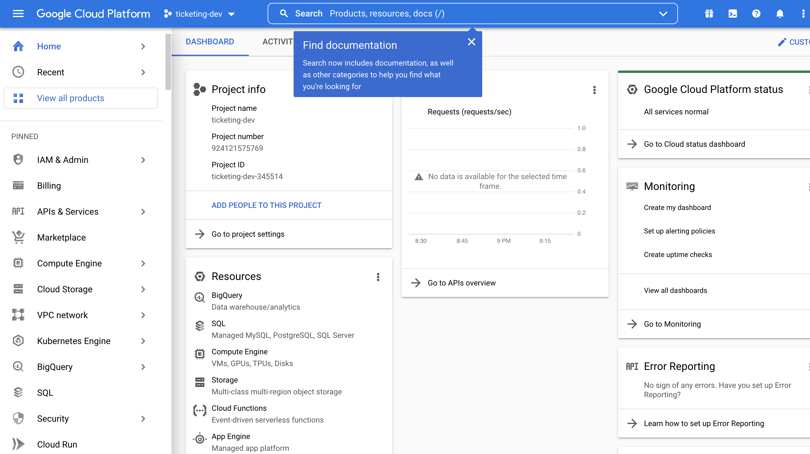

# mini-e-commerce-app

## Description

### Solutions

This application follows the following solutions to solve problems that a simple app may face.


### App overview

This is a ticketing app.


We build **common** library that helps share a bund of codes among services.

### App screen mockup


### Database storage

We need storage to store User, Ticket, Order, Charge.


### Services


### Events


### Auth Service Apis


Currently Auth Service is listening at **port 3000**

### Technologies used

1. Next.js: server side rendering React framework.
2. MongoDB
3. Redis
4. NATS streaming server

### Error handlings


Express error handling: https://expressjs.com/en/guide/error-handling.html

## Project setup

1. In **ticketing/auth/**:
   1. Run `npm init -y`
   2. Run `npm install typescript ts-node-dev express @types/express`
   3. Run `tsc --init` (this produces _tsconfig.json_)
   4. Replace the _"test": "xxxxx"_ script in package.json with _"start": "ts-node-dev src/index.ts"_
      
      
   5. Then `run npm install` (this will runs the command _ts-node-dev src/index.ts_ when npm starts)
   6. Install express validator to assist us to validate user data: `npm install express-validator`
2. In **ticketing**:
   1. Run `skaffold dev` to start skaffold

### Host File Tweak

You need to trick Ingress to think the domain configured in `ingress-srv.yaml` is localhost.
For MacOS/Linux:

- Add `127.0.0.1 posts.com` to `/etc/hosts`
  For Windows:
- Add `127.0.0.1 posts.com` to `C:\Windows\System32\Drivers\etc\hosts`

### Running on cloud

#### Scenarios


Cloud will run your k8s cluster instead of your local machine.


Why google cloud? Because skaffold is developed by google team. Hence it supports many features for google cloud.

#### Step 1: Create your first project on Google Cloud (let's call ticketing-dev)


#### Step 2: Create Kubernetes cluster on Google Cloud

Create Kubernetes Cluster: Menu bar > Kubernetes Engine > Clusters


Enable the Kubernetes service (if not yet enabled). It could take several minutes.


After setup finishes, create the cluster.


Follow the following setup. Note: you should choose zone that is close to your physical location for best performance.


Click on **default-pool** > **Nodes** on the menu bar, then just choose a small virtual machine is enough:


Then finally click **Create**. It may take some time to create.

#### Step 3: Connect to Google Cloud cluster

Kubectl contexts are (or can be understood as) settings that tell Kubernetes to connect to different cluster in the world.


You may be currently connecting to your local cluster through a context we created when first installed Docker for Mac/Windows. You can check the context:


We need to add in a second context to tell kubectl how to connect to the cluster we created on Google Cloud.

We need to install Google Cloud SDK to teach our k8s to connect.
Link: https://cloud.google.com/sdk/docs/quickstart

If setup successfully on Command Line, it can understand command `gcloud`.
Now we can login by running command: `gcloud auth login`
Then `gcloud init` then follow the guide

Now we can create context. There are 2 options:


Notice on the docker desktop, new context is created (we can now toggle between cluster contexts):


#### Step 4: Setup skaffold


Go to console > Find cloud build > Enable the build


Update the skaffold.yaml file. Just need to make small changes.

Remember to update image name in deployment file as well (in our case.. auth-depl.yaml)

#### Step 5: Setup ingress-nginx

Just follow this link: https://kubernetes.github.io/ingress-nginx/deploy/#quick-start
Copy and run the command line:
`kubectl apply -f https://raw.githubusercontent.com/kubernetes/ingress-nginx/controller-v1.1.2/deploy/static/provider/cloud/deploy.yaml`
Make sure connet to correct context (aka. gcloud context)

Also need to follow this guide as we are using GCloud: https://kubernetes.github.io/ingress-nginx/deploy/#gce-gke

Copy and run the command line:
`kubectl create clusterrolebinding cluster-admin-binding --clusterrole cluster-admin --user $(gcloud config get-value account)`

Copy and run the command line:
`kubectl apply -f https://raw.githubusercontent.com/kubernetes/ingress-nginx/controller-v1.1.2/deploy/static/provider/cloud/deploy.yaml`

After running a load balancer is created for us. To see the load balancer, see here:


Get the IP address of the load balancer:


Change the IP address in host file:


#### Step 6: Restart skaffold

Just make sure the context is for GCloud. Then go to the directory and run `skaffold dev`

## Debug

### Error 1:

```
build [us.gcr.io/ticketing-dev-345514/auth] failed: getting cloudbuild client: google: could not find default credentials. See https://developers.google.com/accounts/docs/application-default-credentials for more information.
```

Resolved url: https://stackoverflow.com/questions/41507904/could-not-find-default-credentials

Summary: Run this command `gcloud auth application-default login`
