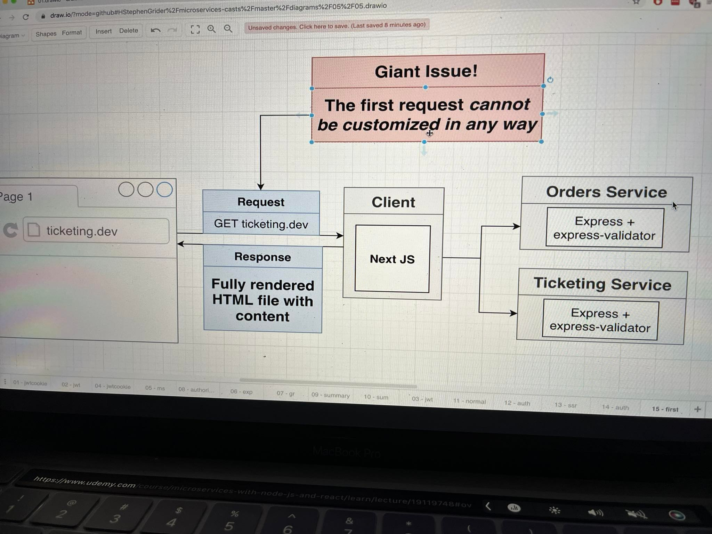
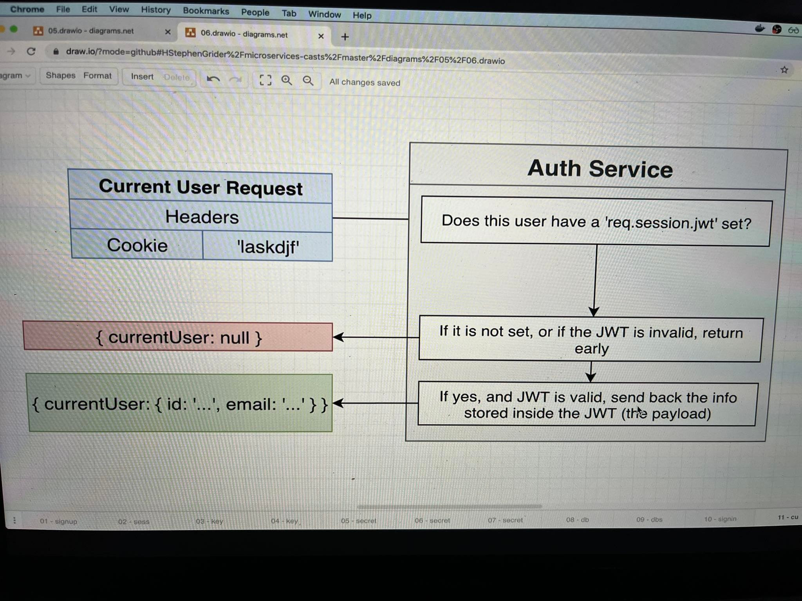
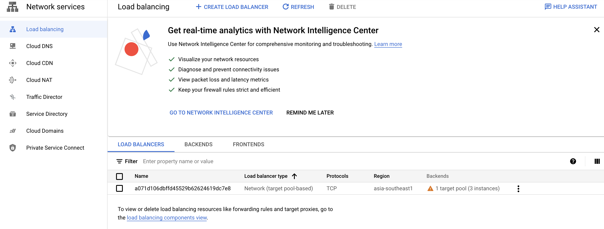

# mini-e-commerce-app

## Description

### Solutions

This application follows the following solutions to solve problems that a simple app may face.


### App overview

This is a ticketing app.


We build **common** library that helps share a bund of codes among services.

### App screen mockup


### Database storage

We need storage to store User, Ticket, Order, Charge.


### Password hash


### Services


### Events


### Auth Service Apis


Currently Auth Service is listening at **port 3000**

#### Authentication Approach

Idea: <br/>

A request to buy ticket needs to contain some form of authentication for the Orders service to verify. <br/>

2 ways to implement this is:

1. Fundamental Option 1: Individual services rely on the auth service
   

However using this way, if Auth service is crashed. Whole app is crashed.

2. Fundamental Option 1.1: Individual services rely on auth service as a gateway
   

We still 100% rely on Auth service. We have the same cons as the Option 1.

3.  Fundamental Option 2: Individual services know how to authenticate a user
    

We choose approach **Option 2** because we can eliminate the dependency of Auth service. However, this can create code duplication. But we can mitigate it by using a common library.

Some other downsides of this approach. Let's look at the following flow:

If we follow this approach, the User will provide us the token and can do whatever he/she wants.

Scenario where UserABC is a bad person and we want to ban:

But the user still has valid token?

We cannot ask the Auth service as it now will create the dependency.
To summarise the problem:


We will go with Option #2. And there is a solution to solve this but it takes a lot of work so out of the scope of project:


OR

We can reject straight away if the token expire without communicating with Auth service. And tell the client to do it himself/herself.

However, with both approaches, there is a window of time where user gets banned but still can make request. Here is another solution to solve this thing:

User ban event will be consumed by other services and shortlive there. You can temporarily store this for the amount of time equal to the lifetime of the token.

**Authentication requirements**

1. The Auth service is not just to check a user whether he/she is authenticated or not. It also needs to provide more details of the user to see whether they are allowed to purchase tickets.
   
2. Quite similar to requirement 1, this is for Admin to create free coupons.
   
3. Need to implement token expiration mechanism. This must be secure so that the user cannot tamper the expiry time of the token. This implies the importance of using the JWT (because cookie is easily tampered - we are asking the browser to expire the cookie. However, the user can easily copy the information in cookie and continue to use)
   
4. One of goals of microservices is to allow different services written in different languages. Hence Auth service need to support this thing. And we don't want each service to implement extra storage/database to store the auth information.
   

To summary:


**Issues with JWT**
Let's look at how a normal flow looks like:


Considering 3 requests, which point in time can we communicate the authentication information from browser to backend?


However, we are building a SERVER-SIDER RENDERED React App. The idea is that we make some initial request (GET ticketing.dev) to backend server. The backend server then render/build the HTML and send the HTML file with all contents inside of it (aka. all the relevant orders, tickets, etc.). The browser just display the full content without having to send later quests. The reason we are using server-side is for SEO (search engine optimization) and in case users have other devices like mobile devices.


And because we need to send authentication info within only one request. Cookie supports this.



To summarise the Auth flow:

**When signup**


**When signin**

**Current user check**

**Current user middleware implementation**


### Technologies used

1. Next.js: server side rendering React framework.
2. MongoDB
3. Redis
4. NATS streaming server

### Error handlings


Express error handling: https://expressjs.com/en/guide/error-handling.html

#### Common response structure

Errors are an aray of objects. And each has a message and maybe a field.


## Project setup

1. In **ticketing/auth/**:
   1. Run `npm init -y`
   2. Run `npm install typescript ts-node-dev express @types/express`
   3. Run `tsc --init` (this produces _tsconfig.json_)
   4. Replace the _"test": "xxxxx"_ script in package.json with _"start": "ts-node-dev src/index.ts"_
      
      
   5. Then `run npm install` (this will runs the command _ts-node-dev src/index.ts_ when npm starts)
   6. Install express validator to assist us to validate user data: `npm install express-validator`
   7. Install async error handling package library `npm install express-async-errors`
   8. Install mongoose for MongoDB `npm install mongoose`
   9. Install cookie-session for Authentication `npm install cookie-session @types/cookie-session`
   10. Install jsonwebtoken for JWT `npm install jsonwebtoken @types/jsonwebtoken`
   11. Install Jest library for writing tests `npm install --save-dev @types/jest @types/supertest jest ts-jest supertest mongodb-memory-server`. We use `--save-dev` to indicate this is development denpendencies (only use for testing at local) and we don't want to download and build into Docker images as it is quite heavy.
   12. Run `npm run test` for running tests. Use `Control + C` to stop the tests running. Whenever you update the file and believe the tests are passed but Jest stills show failed test, try restarting the tests.
2. In **ticketing**:
   1. Run `skaffold dev` to start skaffold

### Host File Tweak

You need to trick Ingress to think the domain configured in `ingress-srv.yaml` is localhost.
For MacOS/Linux:

- Add `127.0.0.1 posts.com` to `/etc/hosts`
  For Windows:
- Add `127.0.0.1 posts.com` to `C:\Windows\System32\Drivers\etc\hosts`

### Running on cloud

#### Scenarios


Cloud will run your k8s cluster instead of your local machine.


Why google cloud? Because skaffold is developed by google team. Hence it supports many features for google cloud.

#### Step 1: Create your first project on Google Cloud (let's call ticketing-dev)


#### Step 2: Create Kubernetes cluster on Google Cloud

Create Kubernetes Cluster: Menu bar > Kubernetes Engine > Clusters


Enable the Kubernetes service (if not yet enabled). It could take several minutes.


After setup finishes, create the cluster.


Follow the following setup. Note: you should choose zone that is close to your physical location for best performance.


Click on **default-pool** > **Nodes** on the menu bar, then just choose a small virtual machine is enough:


Then finally click **Create**. It may take some time to create.

#### Step 3: Connect to Google Cloud cluster

Kubectl contexts are (or can be understood as) settings that tell Kubernetes to connect to different cluster in the world.


You may be currently connecting to your local cluster through a context we created when first installed Docker for Mac/Windows. You can check the context:


We need to add in a second context to tell kubectl how to connect to the cluster we created on Google Cloud.

We need to install Google Cloud SDK to teach our k8s to connect.
Link: https://cloud.google.com/sdk/docs/quickstart

If setup successfully on Command Line, it can understand command `gcloud`.
Now we can login by running command: `gcloud auth login`
Then `gcloud init` then follow the guide

Now we can create context. There are 2 options:


Notice on the docker desktop, new context is created (we can now toggle between cluster contexts):


#### Step 4: Setup skaffold


Go to console > Find cloud build > Enable the build


Update the skaffold.yaml file. Just need to make small changes.

Remember to update image name in deployment file as well (in our case.. auth-depl.yaml)

#### Step 5: Setup ingress-nginx

Just follow this link: https://kubernetes.github.io/ingress-nginx/deploy/#quick-start
Copy and run the command line:
`kubectl apply -f https://raw.githubusercontent.com/kubernetes/ingress-nginx/controller-v1.1.2/deploy/static/provider/cloud/deploy.yaml`
Make sure connet to correct context (aka. gcloud context)

Also need to follow this guide as we are using GCloud: https://kubernetes.github.io/ingress-nginx/deploy/#gce-gke

Copy and run the command line:
`kubectl create clusterrolebinding cluster-admin-binding --clusterrole cluster-admin --user $(gcloud config get-value account)`

Copy and run the command line:
`kubectl apply -f https://raw.githubusercontent.com/kubernetes/ingress-nginx/controller-v1.1.2/deploy/static/provider/cloud/deploy.yaml`

After running a load balancer is created for us. To see the load balancer, see here:


Get the IP address of the load balancer:


Change the IP address in host file:


#### Step 6: Restart skaffold

Just make sure the context is for GCloud. Then go to the directory and run `skaffold dev`

### JWT Creation

**Storing JWT secret on Kubernetes**


Command line: `kubectl create secret generic jwt-secret --from-literal=JWT_KEY=asdf`

To explain:

- `generic`: create a generic secret
- `jwt-secret`: the name of the secret (mostly used for logging purposes, also can be used to refer to a pod inside config file)
- `--from-literal`: where we defines key value pairs for the secret. Currently we only assign 1 key value pair: `jwt=asdf`

To get list of secrets: `kubectl get secrets`

### For running tests
The `supertest` library helps to target a service to available port of our local machine for testing.

## Debug

### Error 1:

```
build [us.gcr.io/ticketing-dev-345514/auth] failed: getting cloudbuild client: google: could not find default credentials. See https://developers.google.com/accounts/docs/application-default-credentials for more information.
```

Resolved url: https://stackoverflow.com/questions/41507904/could-not-find-default-credentials

Summary: Run this command `gcloud auth application-default login`

### Error 2:

If skaffold unable to watch for changes, then add:

```
Try adding "--poll" to your start script

scripts: {

    "start": ts-node-dev --poll src/index.ts"

}
```


## Other resources

1. [Cookie content decoder](https://www.base64decode.org)
2. [JWT decoder](https://jwt.io)
